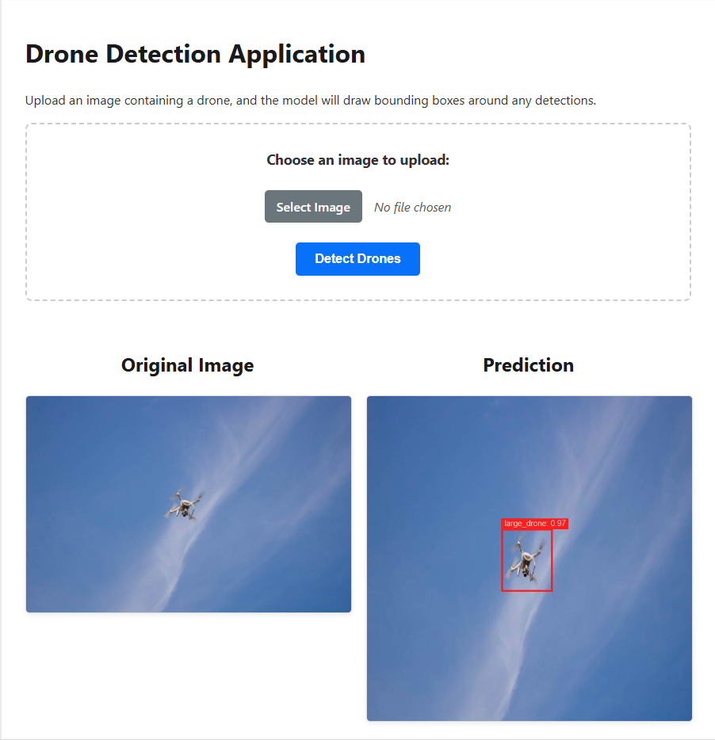

# Drone Detection Web Application with PyTorch and Flask

<p align="center">
  
  
  

</p>

This project demonstrates an end-to-end workflow for training a drone detection model and deploying it as an interactive web application. The application allows users to upload an image, and it returns the image with bounding boxes drawn around any detected drones.

The core of the project is a **Faster R-CNN** model with a **ResNet-18 FPN backbone**, implemented in PyTorch. The training was conducted on the [Drone Detection Dataset](https://www.kaggle.com/datasets/cybersimar08/drone-detection) from Kaggle, and the final application is built using the Flask web framework.

### Features
- **Deep Learning Model:** Utilizes a powerful Faster R-CNN architecture for accurate object detection.
- **Interactive Web UI:** A clean, user-friendly interface built with Flask and HTML/CSS for uploading images.
- **Real-time Inference:** Performs drone detection on user-uploaded images and displays the results instantly.
- **Modular Codebase:** The project is structured with a clear separation between the web application (`app.py`), model inference logic (`inference.py`), and frontend templates.

---

### Demo

The application successfully identifies drones in user-uploaded images.

 <!-- Recommended: Add a screenshot of your running app -->
_A screenshot of the live application interface._


---

## Tech Stack
This project integrates a full stack of technologies, from backend deep learning to frontend web development.

#### Backend (Deep Learning & Data Science)
*   **Python:** The core programming language for the entire project.
*   **PyTorch:** The main deep learning framework used to build, train, and run the model.
*   **torchvision:** Provided the Faster R-CNN model structure, ResNet-18 backbone, and key vision utilities.
*   **Pillow (PIL):** Used for advanced image manipulation to draw custom bounding boxes and labels.
*   **Albumentations:** A powerful library used for image augmentation during model training.
*   **NumPy:** For fundamental scientific computing and numerical operations.

#### Backend (Web Server)
*   **Flask:** A lightweight Python web framework used to build the web server, handle file uploads, and route requests.

#### Frontend
*   **HTML5:** The structure and content of the web page.
*   **CSS3:** All styling, including layout with Flexbox, colors, and fonts.
*   **JavaScript:** For client-side interactivity to display the selected filename.

#### Development & Environment
*   **Git & GitHub:** For version control and repository hosting.
*   **Kaggle Notebooks:** The cloud environment used for model training on an NVIDIA T4 GPU.
*   **Visual Studio Code:** The code editor for local application development.

---

## Project Structure
The repository is organized as follows:

```
drone_detector_app/
|
|-- app.py                 # Main Flask web server
|-- inference.py           # Core model prediction logic
|-- requirements.txt       # Required Python packages
|
|-- static/                # CSS, JS, and image assets
|   |-- css/
|   |   |-- style.css      # Main stylesheet
|   |-- uploads/           # For user-uploaded images (created automatically)
|   |-- predictions/       # For model prediction images (created automatically)
|
|-- templates/             # HTML templates
|   |-- index.html         # Main web page
|
|-- fasterrcnn_drone_detector.pth  # --> NOTE: This file is NOT in the repo <--
|-- .gitignore             # Specifies files for Git to ignore
|-- README.md              # You are here!
```
**Important Note:** The trained model weights (`fasterrcnn_drone_detector.pth`) are **not** included in this repository due to GitHub's file size limits. Please follow the setup instructions to download the model file.

---

## Project Results and Performance

### Model Architecture
The object detection model was built using the following architecture:

| Parameter                 | Value                                       |
| ------------------------- | ------------------------------------------- |
| **Model**                 | Faster R-CNN                                |
| **Backbone**              | ResNet-18 with FPN (Feature Pyramid Network)|
| **Classes**               | 4 (drone, small_drone, large_drone, background) |
| **Pre-trained Weights**   | ImageNet (for the ResNet-18 backbone)       |

### Training Summary
The model was trained on the Kaggle platform with the following key hyperparameters:

| Hyperparameter            | Value                                       |
| ------------------------- | ------------------------------------------- |
| **Framework**             | PyTorch                                     |
| **Epochs**                | 6                                           |
| **Batch Size**            | 8                                           |
| **Optimizer**             | SGD (Momentum: 0.9, Weight Decay: 0.0005)   |
| **Learning Rate**         | 0.01                                        |                        
| **Training Time**         | Approx. 18 minutes per epoch on a Kaggle T4 GPU |

### Quantitative Performance
The model's performance was evaluated on an unseen test set. The primary metric tracked during training was **loss**, which measures how far the model's predictions are from the ground truth. A lower loss indicates better performance.

**Final Loss on the Test Set:**

| Loss Component               | Final Score                  |
| ---------------------------- | ---------------------------- |
| **Total Loss**               | **`[--- 0.1198 ---]`**        |
| Classifier Loss              | `[--- 0.0512 ---]`          |
| Bounding Box Regression Loss | `[--- 0.0450 ---]`          |
| RPN Objectness Loss          | `[--- 0.0121 ---]`          |
| RPN Box Regression Loss      | `[--- 0.0115 ---]`          |

*(Note: For a production-grade evaluation, the next step would be to calculate the mean Average Precision (mAP) metric, which is the industry standard for object detection.)*

---

## How to Run Locally

Follow these steps to set up and run the project on your local machine.

### Prerequisites
- Python 3.8+
- Git

### 1. Clone the Repository
Clone this repository to your local machine:
```bash
git clone https://github.com/MdEhsanulHaqueKanan/drone-detection-deep-learning-flask-app.git
cd drone-detection-deep-learning-flask-app
```

### 2. Set Up a Virtual Environment
It is highly recommended to use a virtual environment to manage dependencies.
```bash
# Create the virtual environment
python -m venv venv

# Activate it
# On Windows:
venv\Scripts\activate
# On macOS/Linux:
source venv/bin/activate
```

### 3. Install Dependencies
Install all the required Python packages using the `requirements.txt` file.
```bash
pip install -r requirements.txt
```

### 4. Download the Model Weights
The trained model file is not included in the Git repository. Download it from the link below and place it in the root directory of the project (`drone_detector_app-flask/`).

**[Download Model (`fasterrcnn_drone_detector.pth`)](https://drive.google.com/file/d/19ugDaNzKPMGZcXog7xPkrO7L3RUtnEoH/view?usp=sharing)**

Your project root should look like this after downloading:
```
drone_detector_app-flask/
|-- app.py
|-- fasterrcnn_drone_detector.pth  <-- The downloaded file
|-- ... (other files)
```

### 5. Run the Flask Application
With the virtual environment activated, start the Flask server:
```bash
flask run
```
The application will be running at **http://127.0.0.1:5000**. Open this URL in your web browser to use the app.

---
_This project is developed by Md. Ehsanul Haque Kanan._