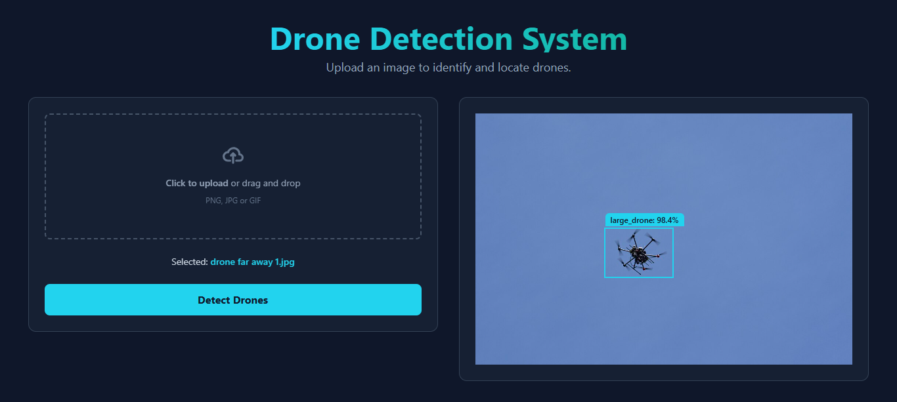
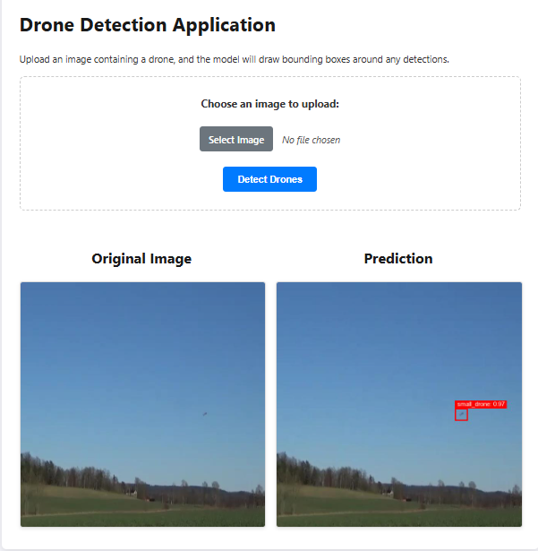

# ✈️ Drone Detection System (Original Monolithic App)

<p align="center">
  
  
  
</p>

This repository contains the original, monolithic version of the Drone Detection System. It is a complete, standalone Flask application that handles the model inference, bounding box drawing, and HTML frontend rendering in a single codebase.

---

### ✨ Project Evolution: Now a Full-Stack Application!

This project was successfully evolved into a modern, decoupled, full-stack application with a separate React frontend and a containerized Python backend. The new version is more scalable, features a significantly improved user interface, and uses a more efficient client-side rendering approach for the bounding boxes.

<div align="center">
  <h4>New Full-Stack Version</h4>
  
</div>

#### 🔗 **Explore the Full-Stack Version:**

| Link                               | URL                                                                                                         |
| :--------------------------------- | :---------------------------------------------------------------------------------------------------------- |
| 🚀 **Live Demo**                   | **[drone-detection-frontend.vercel.app](https://drone-detection-frontend.vercel.app/)** |
| 🎨 **Frontend Repository (React)** | [github.com/MdEhsanulHaqueKanan/drone-detection-frontend](https://github.com/MdEhsanulHaqueKanan/drone-detection-frontend) |
| ⚙️ **Backend API Repository (Flask)** | [github.com/MdEhsanulHaqueKanan/drone-detection-api](https://github.com/MdEhsanulHaqueKanan/drone-detection-api)       |

**Note on Live Demo:** The backend API is hosted on Hugging Face's free community tier. If the app has been inactive, it may "sleep" to save resources. Your first prediction might take **30-90 seconds** as the server wakes up. Subsequent predictions will be much faster!

---

## Demo (of this Original Monolithic Version)



---

## Tech Stack (Original Version)

*   **Backend:** Python, Flask, PyTorch, torchvision, Pillow, Albumentations, NumPy
*   **Frontend:** HTML5, CSS3, JavaScript

---

## Project Results and Performance

The core of the project is a **Faster R-CNN** model with a **ResNet-18 FPN backbone**. The training was conducted on the [Drone Detection Dataset](https://www.kaggle.com/datasets/cybersimar08/drone-detection) from Kaggle.

**Training:** 

This model is not pre-trained. The `fasterrcnn_drone_detector.pth` weights are the result of a complete training process executed from scratch on a Kaggle GPU. This involved writing custom data loaders, implementing the full PyTorch training/validation loop, and evaluating the model. The entire end-to-end process is documented in the [Kaggle Notebook](https://github.com/MdEhsanulHaqueKanan/drone-detection-deep-learning-flask-app/blob/main/notebook/drone%20detection%20kaggle.ipynb) included in this repository.

**Final Loss on the Test Set:**

| Loss Component               | Final Score          |
| ---------------------------- | -------------------- |
| **Total Loss**               | **0.0638**           |

---

## How to Run This Monolithic Version Locally

Follow these steps to set up and run this original project on your local machine.

### 1. Clone the Repository
```
git clone https://github.com/MdEhsanulHaqueKanan/drone-detection-deep-learning-flask-app.git
cd drone-detection-deep-learning-flask-app
```

### 2. Set Up a Virtual Environment
```
python -m venv venv  
```
#### On Windows: 
```
venv\Scripts\activate  
```
##### On macOS/Linux: 
```
source venv/bin/activate   
```

### 3. Install Dependencies
```
pip install -r requirements.txt   
```

### 4. Download the Model Weights

Download the model file from the link below and place it in the **root directory** of the project.

[**Download Model (fasterrcnn\_drone\_detector.pth)**](https://drive.google.com/file/d/19ugDaNzKPMGZcXog7xPkrO7L3RUtnEoH/view?usp=sharing)

### 5\. Run the Flask Application
```
flask run   
```

The application will be running at [**http://127.0.0.1:5000**](http://127.0.0.1:5000).

_This project is developed by Md. Ehsanul Haque Kanan._